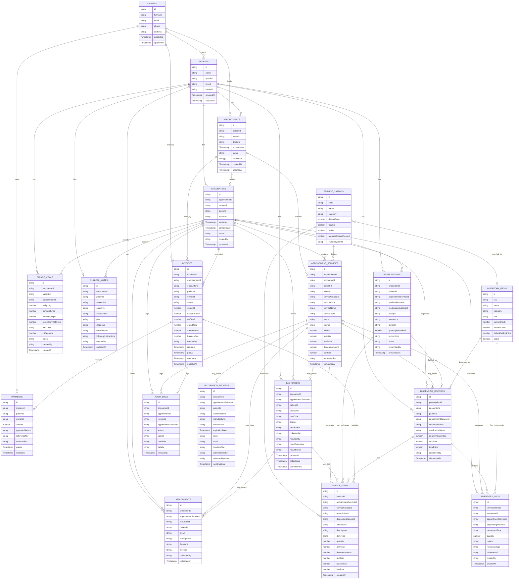

# EMR Encounter, Visit History, Billing, Laboratory & Pharmacy Workflow System
## Full Implementation Guide with ERD

---

## 1. Overview

This document defines the architecture and implementation of a visit-based EMR system with integrated:

- Appointment workflow
- Encounter creation
- Multiple services per visit
- Ad-hoc services during consultation
- Triage and vitals
- Clinical notes
- Laboratory orders and results
- Prescriptions
- Pharmacy dispensing
- Supplies/consumables
- Itemized billing
- Payments
- Visit history
- Audit trail
- Inventory movements

The system is designed for a clinic workflow where services may be pre-booked or added during the consultation.

Example:

Initial booked service:
- Consultation

Added during the visit:
- CBC laboratory test
- Amoxicillin prescription
- Syringe or other consumables
- Vaccination
- Diagnostic imaging

All of these must be clinically recorded and separately itemized in billing.

---

## 2. Current Tech Stack

- Frontend: React 19 + TypeScript 5.8 + Vite 6
- Styling: TailwindCSS 4 + Radix UI
- Charts: Recharts 3.8
- Backend: Firebase Firestore, Firebase Storage, Firebase Auth
- Routing: React Router DOM 7
- Icons: Lucide React
- State: React hooks: useState, useEffect, useCallback

---

## 3. Core Design Principle

The system should follow this rule:

```txt
Everything that happens during a visit is tied to the Encounter.
Everything billable is represented as an Appointment Service.
Every completed billable Appointment Service becomes an Invoice Item.
```

This means:

- Consultation = appointment service
- Vaccination = appointment service + vaccination record
- Lab test = appointment service + lab order
- Dispensed medication = appointment service + prescription/dispensing record
- Supplies/consumables = appointment service or invoice item
- Diagnostics = appointment service + attachment/result
- Billing = generated from completed billable services

---

## 4. High-Level Data Flow

```txt
Patient
→ Appointment
→ Encounter
→ Appointment Services
→ Clinical Records / Lab Orders / Prescriptions / Dispensing
→ Invoice Items
→ Invoice
→ Payments
→ Audit Logs
```

---

## 5. Recommended EMR Tabs

Recommended final tab structure:

1. Visit Summary
2. Triage & Vitals
3. Clinical Notes
4. Orders & Services
5. Medications / Pharmacy
6. Diagnostics & Files
7. Billing
8. History
9. Audit Trail

### Tab Purpose

| Tab | Purpose |
|---|---|
| Visit Summary | Overview of current encounter, doctor, services, status |
| Triage & Vitals | Weight, temperature, heart rate, respiratory rate, MM color, CRT, trends |
| Clinical Notes | SOAP notes, diagnosis, plan, follow-up |
| Orders & Services | Consultation, lab orders, vaccination, procedures, ad-hoc services |
| Medications / Pharmacy | Prescriptions, dispensing, medication billing |
| Diagnostics & Files | Lab results, photos, x-rays, PDFs, other files |
| Billing | Draft invoice, billable services, invoice items, payments |
| History | Previous encounters and comparison |
| Audit Trail | Clinical and billing activity logs |

---

## 6. Workflow Summary

### 6.1 Appointment Booking

```txt
Book Appointment
→ Select initial services
→ Appointment status = scheduled
```

Example initial services:

```txt
Consultation
Vaccination
```

---

### 6.2 Appointment Start

```txt
Start Appointment
→ Create Encounter
→ Copy selected services into appointment_services
→ Appointment status = started
→ Open EMR page
```

---

### 6.3 During Consultation

Doctor or staff may add ad-hoc services:

```txt
Add Lab Test
Add Diagnostic Procedure
Add Vaccination
Add Medication
Add Supply / Consumable
```

Each added service becomes an `appointment_services` record.

---

### 6.4 Laboratory Workflow

```txt
Doctor orders lab
→ Lab appointment_service created
→ lab_order created
→ Staff collects sample
→ Lab result uploaded
→ Lab service marked completed
→ Service becomes billable
→ Invoice item generated
```

---

### 6.5 Prescription & Pharmacy Workflow

Important distinction:

```txt
Prescription = doctor’s medical instruction
Dispensing = pharmacy inventory and billing action
```

Workflow:

```txt
Doctor prescribes medication
→ prescription record created
→ Pharmacy reviews prescription
→ Pharmacy dispenses medication
→ dispensing record created
→ Medication appointment_service created or completed
→ Inventory deducted
→ Invoice item generated
```

---

### 6.6 Supplies / Consumables Workflow

```txt
Staff uses supply
→ Supply service/item recorded
→ Inventory deducted
→ Invoice item generated
```

Examples:

- Syringe
- Gloves
- IV fluids
- Bandage
- Catheter
- Test kit

---

### 6.7 Billing Workflow

```txt
Completed billable appointment_services
→ Generate Draft Invoice
→ Create invoice_items
→ Review discounts/adjustments
→ Issue Invoice
→ Record Payment
→ Mark as Paid / Partially Paid
```

---

## 7. Firestore Data Model

---

### 7.1 patients

```ts
{
  id: string
  name: string
  species: string
  breed: string
  ownerId: string
  createdAt: Timestamp
  updatedAt: Timestamp
}
```

---

### 7.2 owners

```ts
{
  id: string
  fullName: string
  email?: string
  phone?: string
  address?: string
  createdAt: Timestamp
  updatedAt: Timestamp
}
```

---

### 7.3 appointments

```ts
{
  id: string
  patientId: string
  ownerId: string
  doctorId: string
  scheduledAt: Timestamp
  status: 'scheduled' | 'started' | 'completed' | 'cancelled'
  serviceIds: string[]
  createdAt: Timestamp
  updatedAt: Timestamp
}
```

---

### 7.4 encounters

```ts
{
  id: string
  appointmentId: string
  patientId: string
  ownerId: string
  doctorId: string
  startedAt: Timestamp
  completedAt?: Timestamp
  status: 'draft' | 'in-progress' | 'completed'
  createdBy: string
  updatedAt: Timestamp
}
```

---

### 7.5 service_catalog

```ts
{
  id: string
  code: string
  name: string
  category: 'consultation' | 'vaccination' | 'lab' | 'diagnostic' | 'procedure' | 'grooming' | 'medication' | 'supply' | 'pharmacy'
  description?: string
  defaultPrice: number
  taxable: boolean
  active: boolean
  requiresClinicalRecord: boolean
  inventoryItemId?: string
  createdAt: Timestamp
  updatedAt: Timestamp
}
```

Notes:
- Services, medicines, and supplies can all exist in the service catalog.
- Medicines/supplies may link to inventory via `inventoryItemId`.

---

### 7.6 appointment_services

```ts
{
  id: string
  appointmentId: string
  encounterId: string
  patientId: string
  ownerId: string

  serviceCatalogId: string
  serviceCode: string
  serviceName: string
  serviceType: 'consultation' | 'vaccination' | 'lab' | 'diagnostic' | 'procedure' | 'grooming' | 'medication' | 'supply' | 'pharmacy'

  status: 'pending' | 'in-progress' | 'completed' | 'cancelled'
  source: 'pre-booked' | 'doctor-added' | 'staff-added' | 'pharmacy-dispensed' | 'billing-adjustment'

  billable: boolean
  quantity: number
  unitPrice: number
  discountAmount?: number
  taxRate?: number

  performedBy?: string
  completedAt?: Timestamp

  createdBy: string
  createdAt: Timestamp
  updatedAt: Timestamp
}
```

Purpose:
- This is the bridge between EMR and billing.
- Every billable activity should pass through this collection before becoming an invoice item.

---

### 7.7 triage_vitals

```ts
{
  id: string
  encounterId: string
  patientId: string
  appointmentId: string

  weightKg?: number
  temperatureC?: number
  heartRateBpm?: number
  respiratoryRateRpm?: number
  mmColor?: string
  crtSeconds?: number
  notes?: string

  createdBy: string
  createdAt: Timestamp
}
```

---

### 7.8 clinical_notes

```ts
{
  id: string
  encounterId: string
  patientId: string

  subjective?: string
  objective?: string
  assessment?: string
  plan?: string
  diagnosis?: string
  doctorNotes?: string
  followUpInstructions?: string

  createdBy: string
  updatedAt: Timestamp
}
```

---

### 7.9 lab_orders

```ts
{
  id: string
  encounterId: string
  appointmentServiceId: string
  patientId: string

  testName: string
  testCode?: string
  status: 'ordered' | 'sample-collected' | 'processing' | 'completed' | 'cancelled'

  orderedBy: string
  collectedBy?: string
  resultedBy?: string

  resultSummary?: string
  resultFileUrl?: string
  resultStoragePath?: string

  orderedAt: Timestamp
  collectedAt?: Timestamp
  completedAt?: Timestamp
}
```

Purpose:
- Tracks lab workflow separately from billing.
- Billing still comes from `appointment_services`.

---

### 7.10 prescriptions

```ts
{
  id: string
  encounterId: string
  patientId: string
  appointmentServiceId?: string

  medicationName: string
  medicationCatalogId?: string

  dosage: string
  frequency?: string
  duration?: string
  quantityPrescribed?: number
  instructions: string

  status: 'prescribed' | 'partially-dispensed' | 'dispensed' | 'cancelled'

  prescribedBy: string
  prescribedAt: Timestamp
}
```

Purpose:
- Medical instruction from doctor.
- Not automatically billing unless dispensed by pharmacy.

---

### 7.11 dispensing_records

```ts
{
  id: string
  prescriptionId: string
  encounterId: string
  patientId: string

  appointmentServiceId: string
  inventoryItemId: string

  medicationName: string
  quantityDispensed: number
  unitPrice: number
  totalPrice: number

  dispensedBy: string
  dispensedAt: Timestamp
}
```

Purpose:
- Actual pharmacy transaction.
- Links prescription, appointment service, and inventory.

---

### 7.12 vaccination_records

```ts
{
  id: string
  encounterId: string
  appointmentServiceId: string
  patientId: string

  vaccineName: string
  manufacturer?: string
  batchLotNo?: string
  expirationDate?: Timestamp
  dose?: string
  route?: string
  injectionSite?: string
  administeredBy: string
  adverseReaction?: string
  nextDueDate?: Timestamp

  createdAt: Timestamp
}
```

---

### 7.13 attachments

```ts
{
  id: string
  encounterId: string
  appointmentServiceId?: string
  labOrderId?: string
  patientId: string

  fileUrl: string
  storagePath: string
  fileName: string
  fileType: 'image' | 'pdf' | 'video' | 'document'

  uploadedBy: string
  uploadedAt: Timestamp
}
```

---

### 7.14 inventory_items

```ts
{
  id: string
  sku: string
  name: string
  category: 'medicine' | 'vaccine' | 'supply' | 'lab-consumable'
  unit: string
  currentStock: number
  reorderLevel?: number
  defaultSellingPrice?: number
  active: boolean
  createdAt: Timestamp
  updatedAt: Timestamp
}
```

---

### 7.15 inventory_logs

```ts
{
  id: string
  inventoryItemId: string
  encounterId?: string
  appointmentServiceId?: string
  dispensingRecordId?: string

  movementType: 'in' | 'out' | 'adjustment'
  quantity: number
  reason: 'dispensed' | 'used-in-service' | 'manual-adjustment' | 'stock-receipt' | 'void-reversal'

  referenceType: 'encounter' | 'dispensing' | 'service' | 'manual' | 'purchase'
  referenceId?: string

  createdBy: string
  createdAt: Timestamp
}
```

---

### 7.16 invoices

```ts
{
  id: string
  invoiceNo: string

  appointmentId: string
  encounterId: string
  patientId: string
  ownerId: string

  status: 'draft' | 'issued' | 'partially-paid' | 'paid' | 'void'

  subtotal: number
  discountTotal: number
  taxTotal: number
  grandTotal: number
  amountPaid: number
  balanceDue: number

  createdBy: string
  issuedAt?: Timestamp
  paidAt?: Timestamp
  createdAt: Timestamp
  updatedAt: Timestamp
}
```

---

### 7.17 invoice_items

```ts
{
  id: string
  invoiceId: string

  appointmentServiceId?: string
  serviceCatalogId?: string
  prescriptionId?: string
  dispensingRecordId?: string
  labOrderId?: string

  description: string
  itemType: 'service' | 'lab' | 'medicine' | 'supply' | 'vaccine' | 'discount' | 'adjustment'

  quantity: number
  unitPrice: number
  discountAmount: number
  taxRate: number
  taxAmount: number
  lineTotal: number

  createdAt: Timestamp
}
```

---

### 7.18 payments

```ts
{
  id: string
  invoiceId: string
  patientId: string
  ownerId: string

  amount: number
  paymentMethod: 'cash' | 'gcash' | 'maya' | 'bank-transfer' | 'card' | 'other'
  referenceNo?: string

  receivedBy: string
  paidAt: Timestamp
  createdAt: Timestamp
}
```

---

### 7.19 audit_logs

```ts
{
  id: string

  encounterId?: string
  appointmentId?: string
  invoiceId?: string
  appointmentServiceId?: string

  action: string
  userId: string
  userRole: string
  details?: string

  timestamp: Timestamp
}
```

---

## 8. Laboratory Integration

### 8.1 Ordering a Lab Test During Consultation

Doctor clicks:

```txt
[ + Order Lab Test ]
```

System action:

1. Select test from `service_catalog`.
2. Create `appointment_services` record.
3. Create `lab_orders` record linked to appointment service.
4. Status starts as `ordered`.
5. Staff updates status as sample is collected/processed.
6. Result is uploaded or entered.
7. Lab order and appointment service are marked completed.
8. Billing can now include it.

Example service:

```ts
{
  serviceType: 'lab',
  serviceName: 'Complete Blood Count',
  status: 'pending',
  source: 'doctor-added',
  billable: true,
  quantity: 1,
  unitPrice: 500
}
```

Example lab order:

```ts
{
  appointmentServiceId: 'APS-001',
  testName: 'Complete Blood Count',
  status: 'ordered'
}
```

---

## 9. Pharmacy Integration

### 9.1 Prescription vs Dispensing

The system must separate:

| Concept | Meaning |
|---|---|
| Prescription | Doctor’s instruction |
| Dispensing | Pharmacy releases actual medicine |
| Billing | Customer is charged for what was dispensed |

A prescription alone should not automatically create revenue.

Only dispensed medicine should create an invoice item.

---

### 9.2 Medication Workflow

```txt
Doctor prescribes medicine
→ prescription record created
→ Pharmacy reviews prescription
→ Pharmacy dispenses medicine
→ dispensing_records created
→ appointment_services created/completed
→ inventory_logs created
→ invoice_items generated
```

---

### 9.3 Dispensing Medication

When pharmacy dispenses medication:

1. Select prescription.
2. Confirm medication and quantity.
3. Check stock.
4. Create medication `appointment_services`.
5. Create `dispensing_records`.
6. Deduct inventory.
7. Mark prescription as dispensed or partially dispensed.
8. Add medicine to draft invoice or make it available for invoice generation.

Example medication appointment service:

```ts
{
  serviceType: 'medication',
  serviceName: 'Amoxicillin 250mg',
  source: 'pharmacy-dispensed',
  status: 'completed',
  billable: true,
  quantity: 10,
  unitPrice: 25
}
```

Example dispensing record:

```ts
{
  prescriptionId: 'RX-001',
  appointmentServiceId: 'APS-002',
  inventoryItemId: 'INV-AMOX-250',
  medicationName: 'Amoxicillin 250mg',
  quantityDispensed: 10,
  unitPrice: 25,
  totalPrice: 250
}
```

---

## 10. Supplies / Consumables Integration

Supplies may be billed when used.

Examples:

- Syringe
- Gloves
- IV catheter
- Bandage
- Lab test kit
- IV fluids

Workflow:

```txt
Supply used
→ appointment_services record created
→ inventory_logs record created
→ invoice item generated
```

Example:

```ts
{
  serviceType: 'supply',
  serviceName: 'Syringe',
  status: 'completed',
  source: 'staff-added',
  billable: true,
  quantity: 1,
  unitPrice: 50
}
```

---

## 11. Billing Integration

### 11.1 Invoice Generation Rule

```txt
Invoice Items = all completed + billable appointment_services
```

This includes:

- Consultation
- Vaccination
- Lab tests
- Diagnostics
- Procedures
- Dispensed medicines
- Supplies
- Consumables

---

### 11.2 Example Invoice

```txt
Invoice #00045

1. General Consultation              Qty 1   ₱800.00
2. Complete Blood Count              Qty 1   ₱500.00
3. Amoxicillin 250mg                 Qty 10  ₱250.00
4. Syringe                           Qty 1   ₱50.00

Subtotal                                    ₱1,600.00
Discount                                    ₱0.00
Tax                                         ₱0.00
Grand Total                                 ₱1,600.00
Paid                                        ₱0.00
Balance                                     ₱1,600.00
```

---

### 11.3 Invoice Generation Logic

```ts
async function generateInvoiceFromEncounter(encounterId: string) {
  const encounter = await getEncounter(encounterId)

  let invoice = await findInvoiceByEncounter(encounterId)

  if (!invoice) {
    invoice = await createInvoice({
      appointmentId: encounter.appointmentId,
      encounterId: encounter.id,
      patientId: encounter.patientId,
      ownerId: encounter.ownerId,
      status: 'draft',
      subtotal: 0,
      discountTotal: 0,
      taxTotal: 0,
      grandTotal: 0,
      amountPaid: 0,
      balanceDue: 0,
      createdBy: currentUser.uid
    })
  }

  const services = await getCompletedBillableServicesNotYetInvoiced(encounterId)

  const items = services.map(service => {
    const discountAmount = service.discountAmount ?? 0
    const taxRate = service.taxRate ?? 0
    const baseAmount = service.quantity * service.unitPrice
    const taxableAmount = baseAmount - discountAmount
    const taxAmount = taxableAmount * taxRate
    const lineTotal = taxableAmount + taxAmount

    return {
      invoiceId: invoice.id,
      appointmentServiceId: service.id,
      serviceCatalogId: service.serviceCatalogId,
      description: service.serviceName,
      itemType: mapServiceTypeToInvoiceItemType(service.serviceType),
      quantity: service.quantity,
      unitPrice: service.unitPrice,
      discountAmount,
      taxRate,
      taxAmount,
      lineTotal,
      createdAt: new Date()
    }
  })

  await createInvoiceItems(items)
  await recalculateInvoiceTotals(invoice.id)

  return invoice.id
}
```

---

### 11.4 Handling Late Additions

If more services are added after invoice creation:

| Invoice Status | Action |
|---|---|
| Draft | Add new services to same invoice |
| Issued | Create adjustment line or supplemental invoice |
| Partially Paid | Create supplemental invoice or approved adjustment |
| Paid | Create new invoice or approved adjustment |
| Void | Do not add items |

Recommended rule:

```txt
If invoice is already issued or paid, do not silently alter it.
Require adjustment, reversal, or supplemental invoice.
```

---

## 12. Billing Tab UI

Recommended sections:

1. Invoice Summary
2. Live Billable Services
3. Invoice Items
4. Discounts and Adjustments
5. Payments
6. Balance
7. Actions

Example:

```txt
Billing
------------------------------------------------
Invoice Status: Draft

Live Billable Services:
[✓] General Consultation        ₱800.00
[✓] Complete Blood Count        ₱500.00
[✓] Amoxicillin 250mg x 10      ₱250.00
[✓] Syringe                     ₱50.00

Invoice Items:
1. General Consultation         Qty 1    ₱800.00
2. Complete Blood Count         Qty 1    ₱500.00
3. Amoxicillin 250mg            Qty 10   ₱250.00
4. Syringe                      Qty 1    ₱50.00

Subtotal                                ₱1,600.00
Discount                                ₱0.00
Tax                                     ₱0.00
Grand Total                             ₱1,600.00
Paid                                    ₱0.00
Balance                                 ₱1,600.00

[Generate Draft Invoice]
[Add Missing Billable Items]
[Issue Invoice]
[Record Payment]
[Print Invoice]
```

---

## 13. Inventory Integration

### 13.1 When Inventory Should Be Deducted

Inventory should be deducted when:

- Medication is dispensed
- Vaccine is administered
- Supply is consumed
- Lab consumable is used

Inventory should not be deducted when:

- Doctor only writes prescription
- Lab is ordered but not performed
- Service is cancelled
- Invoice is drafted but service not performed

---

### 13.2 Inventory Deduction Logic

```ts
async function deductInventoryForService(service: AppointmentService) {
  const catalogItem = await getServiceCatalogItem(service.serviceCatalogId)

  if (!catalogItem.inventoryItemId) return

  await createInventoryLog({
    inventoryItemId: catalogItem.inventoryItemId,
    encounterId: service.encounterId,
    appointmentServiceId: service.id,
    movementType: 'out',
    quantity: service.quantity,
    reason: 'used-in-service',
    referenceType: 'service',
    referenceId: service.id,
    createdBy: currentUser.uid,
    createdAt: new Date()
  })

  await decrementInventoryStock(catalogItem.inventoryItemId, service.quantity)
}
```

---

## 14. Previous Visits / History

The History tab should act as a visit navigator.

Recommended layout:

```txt
Previous Visits
--------------------------------
Apr 25, 2026 | Consultation + CBC + Medication | Current
Mar 10, 2026 | Follow-up
Jan 05, 2026 | Initial Visit
```

Clicking a previous visit loads:

- Encounter summary
- Triage vitals
- Clinical notes
- Services performed
- Lab results
- Prescriptions
- Dispensed medications
- Attachments
- Invoice summary

Do not navigate away from the EMR page.

---

## 15. Compare Mode

Optional but high-value.

Example:

```txt
Weight: 2.1 kg ↑ from 1.9 kg
Temperature: 38.5°C ↓ from 39.1°C
Heart Rate: 110 bpm ↑ from 105 bpm
```

Use historical `triage_vitals` records by `patientId`.

---

## 16. React Component Architecture

Recommended page structure:

```tsx
<EMRPage>
  <VisitHeader />
  <ServiceSelector />
  <Tabs>
    <VisitSummary />
    <TriageVitals />
    <ClinicalNotes />
    <OrdersServices />
    <MedicationsPharmacy />
    <DiagnosticsFiles />
    <BillingTab />
    <History />
    <AuditTrail />
  </Tabs>
</EMRPage>
```

Recommended major components:

```tsx
<OrdersServices>
  <ServiceList />
  <AddServiceDialog />
  <LabOrdersPanel />
  <VaccinationPanel />
</OrdersServices>

<MedicationsPharmacy>
  <PrescriptionList />
  <AddPrescriptionDialog />
  <DispenseMedicationDialog />
  <DispensingHistory />
</MedicationsPharmacy>

<BillingTab>
  <InvoiceSummary />
  <BillableServicesList />
  <InvoiceItemsTable />
  <DiscountAdjustmentPanel />
  <PaymentsPanel />
  <BillingActions />
</BillingTab>

<History>
  <VisitTimeline />
  <EncounterSnapshot />
  <CompareMode />
</History>
```

---

## 17. React State Management

Recommended state:

```ts
const [selectedEncounterId, setSelectedEncounterId] = useState<string>()
const [selectedInvoiceId, setSelectedInvoiceId] = useState<string>()
const [activeTab, setActiveTab] = useState<string>('visit-summary')
const [selectedServiceId, setSelectedServiceId] = useState<string>()
```

Data loading:

```ts
useEffect(() => {
  if (!selectedEncounterId) return

  fetchEncounter(selectedEncounterId)
  fetchAppointmentServices(selectedEncounterId)
  fetchVitals(selectedEncounterId)
  fetchClinicalNotes(selectedEncounterId)
  fetchLabOrders(selectedEncounterId)
  fetchPrescriptions(selectedEncounterId)
  fetchDispensingRecords(selectedEncounterId)
  fetchAttachments(selectedEncounterId)
  fetchInvoiceByEncounter(selectedEncounterId)
}, [selectedEncounterId])
```

---

## 18. Firebase Storage

Recommended storage paths:

```txt
encounters/{encounterId}/{fileName}
encounters/{encounterId}/labs/{labOrderId}/{fileName}
invoices/{invoiceId}/{fileName}
patients/{patientId}/{fileName}
```

Upload example:

```ts
const uploadEncounterFile = async (file: File, encounterId: string) => {
  const fileRef = storageRef(`encounters/${encounterId}/${file.name}`)
  await uploadBytes(fileRef, file)
  return getDownloadURL(fileRef)
}
```

---

## 19. Permissions

Recommended permissions:

### Doctor

- View patient records
- Add clinical notes
- Add lab orders
- Add prescriptions
- Complete consultation/procedure services
- View billing summary only

### Staff / Nurse

- Start appointment
- Add triage
- Upload files
- Collect samples
- Mark lab sample collected
- Add basic supplies used

### Laboratory Staff

- View lab orders
- Update lab order status
- Upload lab results
- Mark lab completed

### Pharmacy

- View prescriptions
- Dispense medications
- Deduct inventory
- Create medication appointment services
- View dispensing history

### Cashier

- View completed billable services
- Generate draft invoice
- Issue invoice
- Record payments
- Print invoice/receipt

### Admin

- Full access
- Void invoice
- Approve discounts
- Approve adjustments
- Override service/billing records
- View audit trail

---

## 20. Firestore Index Recommendations

Likely composite indexes:

### encounters

- patientId ASC, startedAt DESC
- appointmentId ASC

### appointment_services

- encounterId ASC, status ASC
- encounterId ASC, billable ASC, status ASC
- appointmentId ASC, encounterId ASC

### triage_vitals

- patientId ASC, createdAt ASC

### lab_orders

- encounterId ASC, status ASC
- appointmentServiceId ASC

### prescriptions

- encounterId ASC, status ASC
- patientId ASC, prescribedAt DESC

### dispensing_records

- encounterId ASC, dispensedAt DESC
- prescriptionId ASC

### invoices

- encounterId ASC
- ownerId ASC, createdAt DESC
- status ASC, createdAt DESC

### invoice_items

- invoiceId ASC
- appointmentServiceId ASC

### payments

- invoiceId ASC, paidAt DESC

### inventory_logs

- inventoryItemId ASC, createdAt DESC
- encounterId ASC, createdAt DESC

### audit_logs

- encounterId ASC, timestamp DESC
- invoiceId ASC, timestamp DESC

---

## 21. Audit Trail Requirements

Audit should log:

### Clinical

- Appointment started
- Encounter created
- Triage added/edited
- Clinical note added/edited
- Service added
- Service completed
- Lab ordered
- Lab result uploaded
- Prescription created
- Medication dispensed
- File uploaded
- Encounter completed

### Billing

- Invoice generated
- Invoice item added
- Invoice item removed
- Discount applied
- Invoice issued
- Payment recorded
- Invoice voided
- Adjustment created
- Supplemental invoice created

### Inventory

- Medicine dispensed
- Vaccine administered
- Supply consumed
- Stock adjusted
- Void reversal performed

---

## 22. Full ERD Diagram

The following Mermaid ERD can be rendered in GitHub, many Markdown previewers, Mermaid Live Editor, or documentation tools that support Mermaid.



---

## 23. Key Implementation Rules

1. One appointment visit should create one encounter.
2. Do not create a separate EMR page for each service.
3. Use `appointment_services` as the bridge between clinical work and billing.
4. Lab tests added during a visit should create both `appointment_services` and `lab_orders`.
5. Prescriptions should not be billed until dispensed.
6. Dispensed medicines should create `dispensing_records`, inventory logs, and billable appointment services.
7. Supplies and consumables should be recorded and itemized separately.
8. Invoice items should be generated from completed billable appointment services.
9. Draft invoices may be updated.
10. Issued or paid invoices should require adjustment, supplemental invoice, or admin override.
11. Inventory deduction should happen when items are dispensed or consumed, not when merely prescribed or ordered.
12. Previous visits should be available through the History tab.
13. Every clinical, billing, and inventory action should be logged in audit logs.

---

## 24. Final End-to-End Workflow

```txt
Book Appointment
→ Select Consultation
→ Start Appointment
→ Create Encounter
→ Create Consultation Service
→ Staff Enters Triage
→ Doctor Examines Patient
→ Doctor Orders CBC
→ CBC Lab Service Created
→ Lab Order Created
→ Doctor Prescribes Amoxicillin
→ Prescription Created
→ Pharmacy Dispenses Amoxicillin
→ Medication Service Created
→ Dispensing Record Created
→ Inventory Deducted
→ Lab Result Uploaded
→ Lab Service Completed
→ Consultation Service Completed
→ Generate Draft Invoice
→ Invoice Items Created:
   1. Consultation
   2. CBC Lab Test
   3. Amoxicillin
   4. Supplies
→ Issue Invoice
→ Record Payment
→ Invoice Paid
→ Encounter Completed
→ Visit Available in History
```

---

## 25. Future Enhancements

- AI-assisted diagnosis suggestions
- Vitals anomaly detection
- Lab result interpretation support
- Vaccination reminders
- Medication refill reminders
- Online owner portal
- Online payment integration
- Inventory low-stock alerts
- Automatic vaccine stock deduction by lot number
- PDF invoice export
- PDF encounter summary
- Offline triage capture
- Role-based dashboards
